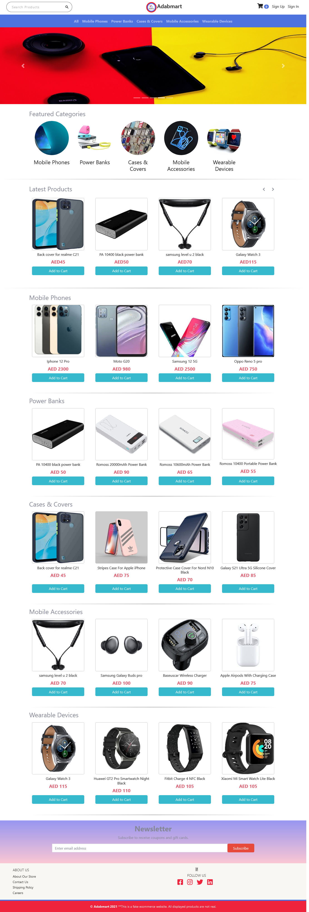

# Adabmart

## :pushpin: Table of contents

- [Introduction](#white_check_mark-introduction)
- [Demo Website](#eyes-demo-website)
- [Technologies](#computer-technologies)
- [Features](#rocket-features)
- [How to run](#construction-worker-how-to-run)
- [License](#closed-book-license)

## :white_check_mark: Introduction

Ecommerce website designed with Node js, Express js, and Mongoose.

## :eyes: Demo Website

This website is deployed on Heroku and can be accessed via the following link:

[Adabmart on Heroku](https://adabmart.herokuapp.com/)

This website is like a real online store where you can add products to your cart and pay for them. you can try the checkout process by using any test card number provided by stripe like 5555 5555 5555 4444 with any expiration date, CVC, and zip codes. Please <u><b>DO NOT</b></u> use real card number and data.

Only users with Admin role can access the admin panel.

## :computer: Technologies

This project was built with:

- Node.js
- MongoDB
- Express
- Bootstrap
- FontAwesome
- Stripe API for payment in the checkout page
- Mailgun: used to send emails from the contact us form
- Mailchimp: used to process emails for newsletter subscription 
- Passport: used for authentication
- Express Validator: used for form validation

## :rocket: Features

The application displays a virtual bags store that contains virtual products and contact information.

Users can perform the following:

- Create an account, login or logout
- Browse available products added by the admin
- Add products to the cart
- Delete products from the cart
- Display the cart
- Checkout, for only logged in users
- The profile contains all user details including all completed orders

Admins can perform the following:

- Login or logout and access the admin panel
- perform CRUD on all models(categories, products, users and orders) in the database except the cart model which can only be modified by the logged in user before the purchase and it is deleted after the purchase.

## :construction_worker: How To Run

To run this application, you have to set your own environmental variables. some variables are hidden from view for security reasons, they are created as environmental variables with the use of dotenv package. Below are the variables that you have to set in order to run the application:

- LOCAL_URI: this is the connection string of your MongoDB Local database.

- MONGO_URI: this is the connection string of your MongoDB Atlas database.

- SESSION_SECRET: secret message for the session. You can use any string for this.

- STRIPE_SECRET_KEY: the stripe package is used to process payment in the checkout route. To get this, you should set up a stripe account and put your private API key here.

- MAILGUN_API_KEY, MAILGUN_DOMAIN: these are Mailgun required variables to process mails sent by users in the contactus page, you have to setup Mailgun account to get these.

- MAILCHIMP_API_KEY, MAILCHIMP_LIST_ID and MAILCHIMP_SERVER_PREFIX: these are Mailchimp required variables to process newsletter subscribers' email, you have to setup Mailchimp account to get these.

After setting up these environmental variables in the .env file at the root of the project, you can now run "npm start" in the terminal and the application should work.

## :closed_book: License

- This project is under the [MIT license](./LICENSE).

- Copyright 2021 © [Bolajoko Aliyu](https://github.com/bolajokoaliyu)
